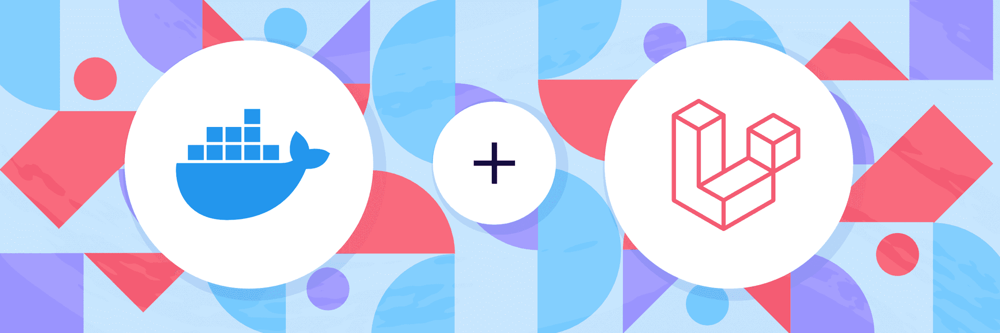

# Laravel with Docker

A docker-compose file for laravel applications with dockerfile.

Dockerfile use `php 8.1-fpm` as default version and you can use latest features of **laravel** version `^9.x`.

## Requirements

As you know you must install Docker with Docker-compose, In order to install these packages you can follow these links:

- [Install Docker CE](https://docs.docker.com/install/)
- [Install Docker-Compose](https://docs.docker.com/compose/install/)

## Usage

That's very easy, Just clone the project and pass 3 steps:

1. Go to root of the project.
2. Run this command for install docker dependencies:
   ```bash
   docker-compose up -d
3. Go to the **code** folder and run this command for install laravel
   independence [See laravel documentation](https://laravel.com/docs/9.x#your-first-laravel-project)
   ```bash
   docker-compose exec app composer create-project laravel/laravel .

### Notes

- You can edit `VIRTUAL_HOST` in `docker-compose.yml` file and use custom domain for your _DOMAIN_ _project_ and
_PHPMYADMIN_ and **don't forget add domain to your host**.
- After edit anything in `docker-compose` you can run this command for down docker:
   ```bash
   docker-compose down
    ```

  and then run this command for start docker:
  ```bash
  docker-compose up -d

Enjoy! 😍
